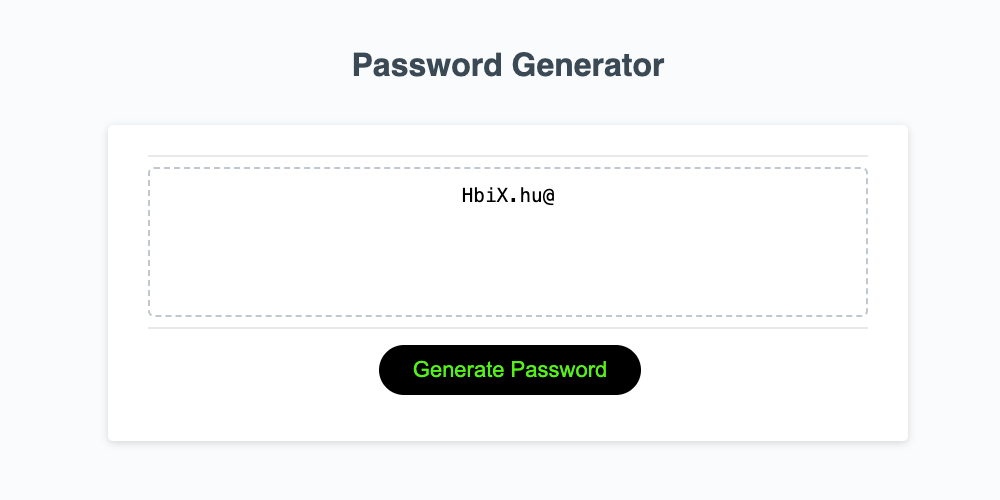

# JavaScript: Password Generator

## Description
The password generator creates a randomly generated password based on the responses the user gives when prompted.

## Installation
link to deployed application:

## Usage
Click the button "generate password" and answer the following prompted questions.

After answering all questions the user will get a random generated password in the text box.

## Mock-Up

The following image shows the web application's appearance and functionality:

